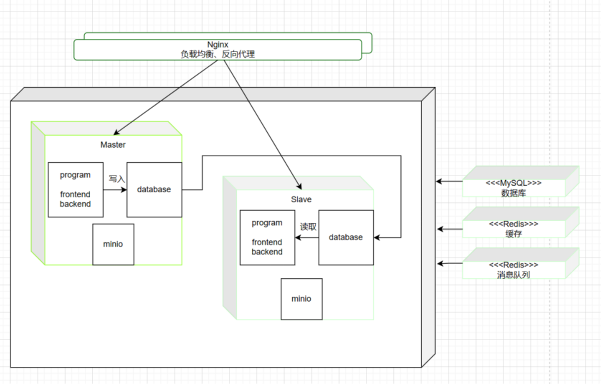
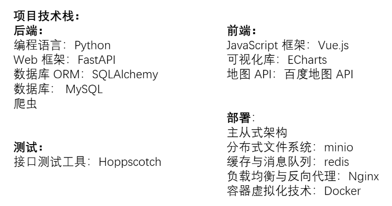

# 大气污染时空经济效益可视分析
山东大学计算机科学与技术学院数据班大数据分析与实践（可视化）课程大作业：大气污染时空经济效益可视分析（前端）Vue3+百度地图API+ECharts
## 项目简介
本项目是山东大学计算机科学与技术学院数据班大数据分析与实践课程大作业。 
我们本次的项目实现了一个大气污染可视分析系统： 
我们可视化了2013-2018年六年的大气监测数据，从时空角度分析其动态变化趋势；通过多图表对天津市的大气污染数据的分析，我们从中得出大气污染对健康和经济造成的影响；所有图可交互，389个城市六年污染数据动态展现，便捷查询，结合时间段内污染事件，快速分析出某地监测数据异常原因，利于污染治理；基于大气污染数据，结合神经网络训练预测模型，提升监测水平；基于医学数据，分析健康效应和经济效益；使用GPT-4接口实现了文字语音加图片与AI交互，AI助力分析大气污染各模块；完善的生态，允许用户通过爬虫一键获取历史上任意一天的天气数据，用户也可自行文字添加与文件添加污染相关事件参与贡献；主从式框架提高了容错性与可靠性，降低了服务器的负载，提高了性能；为项目编写DockerFile，方便用户根据需要自行修改然后构建镜像。
## 项目后端地址：https://github.com/mozhong123/Visual_analysis_of_air_pollution-backend
## 项目前端地址：https://github.com/mozhong123/Visual_analysis_of_air_pollution-frontend
## 项目背景
近年来，空气质量监测站收集了大量具有高维度和时间序列特征的空气质量数据。如何利用这些数据分析和了解空气污染传播模式，并为决策者提供有效建议是非常具有挑战性的。我们需要使用可视化分析技术和可视化方法来探索和发现大量空气质量数据背后隐藏的模式和规律。
## 任务介绍
1. 大气污染物的时空动态变化趋势是怎样的？主导因素是什么？
2. 不同城市大气污染物的健康效应和经济效益是怎样的？主导因素是什么？
3. 基于大数据如何提高环境监测和污染物健康效应评估的准确性？
## 项目架构

## 技术栈

## 项目展示：

## 未来展望
1.我们的大气污染可视分析系统是一个面向所有人开放的系统，但尚未设置管理端与用户端。因此，未来我们考虑逐步完善管理端与用户端的设计，增加权限认证，对不同用户与管理作区分。同时实现用户操作的溯源，即实现用户可以查看自己的所有贡献，具体一点便是对自己上传过的文件可以进行下载，也可以查看自己爬取的数据与添加的事件等。为了保护用户隐私，我们也可以对用户上传的文件作混合式加密，更可以引入区块链对用户的操作进行上链，真正实现防篡改。 
2.实时爬虫只能爬取精确到天的污染物数据，没有风向等数据 。未来我们将通过爬虫获取更多维的数据，不只局限于大气污染方面，还有联网舆情、医学等大数据，与时俱进地更新与展现我们系统的各个模块。 
3.随着数据量的增大，未来考虑多引入几台从服务器，现在一主一从体现不出主从框架与我们设计的负载均衡的优势。 
4.我们不只局限于一个系统，更多的是希望基于我们的系统形成一个大气污染可视分析的社区，聚集更多人的智慧为治理大气污染这一全人类的共同问题献出一份力量。

## 开发基本流程如下：                 
## 参考链接：https://xie.infoq.cn/article/056d8e9c078ac6a327b66bf3e#
## 省流版：
### 点击fork将项目fork到自己仓库
### 在本机合适的文件夹下右键选择git bash here
### 输入git clone xxx    (xxx为自己仓库的链接)
### 然后输入git remote add upstream https://github.com/mozhong1231/Visual_analysis_of_air_pollution
### 自行修改代码
### git status查看哪些文件被修改
### git add .用来添加所有被修改的文件，也可以用git add 文件名 添加单个文件，无关文件不要提交
### 添加完之后用git commit -m '自行修改的注释'  进行提交
### 在push之前一定要看看远程仓库有无更新，有更新先在自己仓库中点击Sync fork，然后点击update branch，再git pull origin master将新的commit拉到本地
### 再用git push origin master推送到自己的远程仓库
### 如果git的各种操作报错timeout，可以上网搜索让git默认使用代理，以后都挂着梯子提交即可
### 如果别人和自己修改了同一份文件导致冲突无法pull或push：参考链接：https://blog.csdn.net/wowoniuzailushang/article/details/78517744#
### push成功后，点击contribute下面的open pull request提交pr，在title写好本次更新的内容。如果分支被merge了会有邮件发到邮箱，如果有需要修改的地方我会comment，对照着修改即可
### 另，只要pr一直开着，后续的提交就会默认被合并到这个pr里，无需新开或关闭pr

# 项目结构如下：
## src 目录: 这是你的源代码目录，包含了你的 Vue 组件、JavaScript 文件、样式和模板文件。
main.js: 这是应用的入口文件，通常用来创建 Vue 实例、引入全局依赖（如路由器和状态管理），并将根组件挂载到 DOM 中。 
App.vue: 这是根组件，它包含应用的整体结构、布局和全局样式。 
components 目录: 这是存放可重用组件的目录。 
views 目录: 这是存放页面级组件的目录，通常对应着不同的路由。 
router 目录: 这是存放路由配置的目录，通常包括路由的定义和路由守卫。 
assets 目录: 这是存放静态资源文件，如图像、样式和字体的目录。 
## public 目录: 这是存放静态文件的目录，这些文件不会被 Webpack 处理，而是直接复制到构建目录。通常包括 index.html 作为主 HTML 模板，以及其他不需要经过构建过程的文件。
## package.json: 这是项目的配置文件，包括项目名称、依赖、脚本等信息。
## vue.config.js: 这是自定义 Vue CLI 配置的文件，你可以在这里配置构建、开发服务器、代理、自定义 webpack 配置等。
# Thanks for star!

